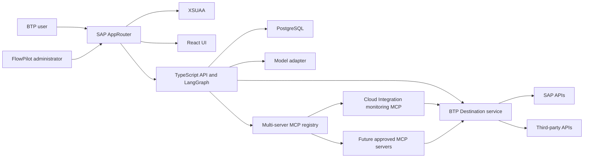

# FlowPilot Architecture

## System view



## Trust boundaries

1. The browser is untrusted. It does not choose its user or authorization scopes.
2. AppRouter performs interactive login and forwards the XSUAA token to the API.
3. The API validates the token again and enforces scopes on every protected endpoint.
4. Conversation ownership uses a stable key derived from validated tenant and subject claims.
5. Model responses, MCP metadata, tool arguments, and tool results are untrusted data.
6. Destinations and Credential Store hold connection details and secrets outside source control.
7. Only validated `ChatAdmin` requests can change MCP registry state or trigger an immediate health check. Models and ordinary chat users cannot call the registry administration operations.
8. Registry endpoints are constrained by an approved server policy preset. Server-side validation blocks unsupported schemes, hosts, ports, redirects, and private or metadata targets that are outside the approved deployment boundary; the preset owns the MCP path and invocation scope.

## Deployment topology

The main MTA contains independently scalable Cloud Foundry modules:

- `flowpilot-approuter`: public entry point and static UI host.
- `flowpilot-api`: stateless backend and LangGraph runtime.
- `flowpilot-web`: build-only React artifact copied into AppRouter.
- `flowpilot-mcp-cloud-integration`: public Streamable HTTP MCP service with a
  dedicated XSUAA technical-client boundary.

The MTA declares the user-facing XSUAA service, the dedicated
`flowpilot-mcp-auth` XSUAA service, Destination, application logging, BTP
PostgreSQL, and SAP Credential Store. PostgreSQL and Credential Store are bound
only to the API. Credential Store supplies server-side model credentials and is
never bound to browser-facing modules; its provider payloads are decrypted inside
the API. The MCP XSUAA descriptor grants `McpInvoke` only to the API's existing
XSUAA application; the API exchanges its own bound client credentials for a
short-lived `McpInvoke` token.

MCP servers use the shared server framework but remain independently deployable so a new connector does not require redeploying the chat application.

## MCP registry and administration

- The registry supports multiple independently deployable MCP servers from its first implementation. Each record has a stable server ID, display name, generic policy-preset ID, Streamable HTTP endpoint, optional external port, authentication-profile reference, explicit allowed tool names, derived FlowPilot scopes, enabled state, and operational limits.
- PostgreSQL stores the non-secret runtime registry state and latest health metadata. Authentication profiles reference BTP-managed bindings or destinations; tokens, client secrets, and certificates are never stored in registry rows or returned to the browser.
- The generic secure MCP preset accepts HTTPS endpoints (plus loopback HTTP for local verification), fixes the protocol path to `/mcp`, derives the `McpInvoke` scope, and preserves an explicit per-server tool allowlist. The `technical:flowpilot-mcp` profile obtains a runtime client-credentials token from the bound MCP XSUAA service; Destination profile references remain available for separately approved connectors. The administrator UI therefore edits connection identity and allowlist fields rather than protocol plumbing.
- For a Cloud Foundry-hosted server, the UI stores its HTTPS route; the application still listens on the platform-assigned process port. The optional external port is bounded and unique registry metadata, not a replacement for the platform route.
- Toggling a server off immediately removes its tools from new registry resolutions. Toggling it on requires a successful authenticated capability probe before its tools are exposed.
- The **Ping** action is an authenticated server-side MCP capability probe with a short timeout, not an ICMP request or browser fetch. It records safe status, latency, protocol compatibility, last-check time, and the server's discovered tool count while separately verifying that every allowlisted tool exists, without returning raw upstream errors or credentials.
- Health states are `never_checked`, `healthy`, `unhealthy`, and `stale`. Only an enabled server with a fresh healthy probe is considered for a chat turn; stale or failed servers contribute no tools and do not change the administrator-selected enabled flag.
- Tool names are namespaced by server ID. A `ToolOperator` identity receives only the advertised tools explicitly allowlisted by each eligible server; chat-only identities resolve no tools. The registry fails closed on duplicate names, unknown tools, missing authentication, incompatible protocol versions, disabled servers, and failed health checks.
- Milestone 5 restricts downstream SAP and Event Mesh connector operations to reviewed HTTP `GET` requests. MCP Streamable HTTP still uses the methods required by the pinned MCP protocol, and registry toggles remain authenticated state-changing application operations.

The first live record is the Cloud Integration monitoring server for bounded Message Processing Log metadata. The same control plane can later register a separate Cloud Integration content server and Event Mesh server, each with its own destination, credentials, allowlist, roles, and deployment lifecycle.

## Request identity

Production requests follow this path:

```text
Browser -> AppRouter/XSUAA -> forwarded bearer token -> API validation -> scope check
```

Local development can use explicit mock identity only when `AUTH_MODE=mock` and `NODE_ENV` is not `production`.

## Scaling model

- No chat or authorization state is stored in process memory.
- AppRouter and API instances can be scaled independently.
- PostgreSQL holds durable application and LangGraph checkpoint state.
- MCP servers use Streamable HTTP and scale independently.
- Timeouts and circuit breakers prevent a failing dependency from exhausting application capacity.

## Chat runtime

- The web application uses UI5 Web Components with the standard `sap_horizon` theme.
- The API derives conversation ownership from validated XSUAA tenant and subject claims.
- PostgreSQL stores the owned conversation catalog and LangGraph checkpoints.
- The API prefers the certificate-bearing PostgreSQL service binding over the buildpack's plain `DATABASE_URL`, validates the supplied CA, and shares one TLS-enabled pool with the repository and LangGraph checkpointer.
- LangGraph depends on a provider-neutral LangChain chat-model interface.
- Groq is the initial default; Groq, OpenAI, and Anthropic adapters sit behind the same server-side factory.
- SAP Credential Store holds deployed provider keys. The API resolves the selected provider's fixed credential reference lazily, decrypts the service's JWE response, and caches the value only in memory for a bounded period.
- Provider, model, limits, and timeouts are server configuration and cannot be selected by the browser.
