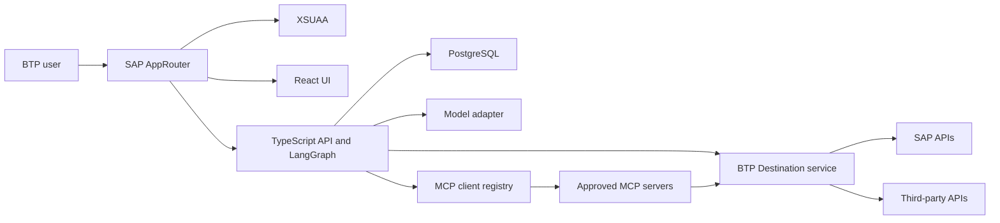

# FlowPilot Architecture

## System view



## Trust boundaries

1. The browser is untrusted. It does not choose its user or authorization scopes.
2. AppRouter performs interactive login and forwards the XSUAA token to the API.
3. The API validates the token again and enforces scopes on every protected endpoint.
4. Conversation ownership uses a stable key derived from validated tenant and subject claims.
5. Model responses, MCP metadata, tool arguments, and tool results are untrusted data.
6. Destinations and Credential Store hold connection details and secrets outside source control.

## Deployment topology

The main MTA contains independently scalable Cloud Foundry modules:

- `flowpilot-approuter`: public entry point and static UI host.
- `flowpilot-api`: stateless backend and future LangGraph runtime.
- `flowpilot-web`: build-only React artifact copied into AppRouter.

The MTA binds XSUAA and Destination service initially. The private-chat milestone adds BTP PostgreSQL and SAP Credential Store when their owning code paths are introduced and tested. Credential Store supplies server-side model credentials; it is never bound to the browser-facing modules.

MCP servers use the shared server framework but remain independently deployable so a new connector does not require redeploying the chat application.

## Request identity

Production requests follow this path:

```text
Browser -> AppRouter/XSUAA -> forwarded bearer token -> API validation -> scope check
```

Local development can use explicit mock identity only when `AUTH_MODE=mock` and `NODE_ENV` is not `production`.

## Scaling model

- No chat or authorization state is stored in process memory.
- AppRouter and API instances can be scaled independently.
- PostgreSQL holds durable application and LangGraph checkpoint state.
- MCP servers use Streamable HTTP and scale independently.
- Timeouts and circuit breakers prevent a failing dependency from exhausting application capacity.

## Chat runtime

- The web application uses UI5 Web Components with the standard `sap_horizon` theme.
- The API derives conversation ownership from validated XSUAA tenant and subject claims.
- PostgreSQL stores the owned conversation catalog and LangGraph checkpoints.
- LangGraph depends on a provider-neutral LangChain chat-model interface.
- Groq is the initial default; Groq, OpenAI, and Anthropic adapters sit behind the same server-side factory.
- SAP Credential Store holds deployed provider keys.
- Provider, model, limits, and timeouts are server configuration and cannot be selected by the browser.
