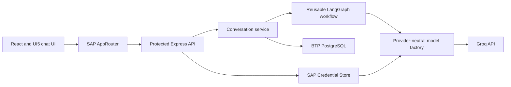

# Private Chat Milestone

## Outcome

Turn the authenticated foundation into a useful but deliberately narrow application: a signed-in user can create a private conversation, send a message to a Groq-backed LangGraph workflow, receive a response, and reload the conversation later.

## Approved choices

- SAP Horizon UI through UI5 Web Components for React.
- Groq as the default model provider.
- `llama-3.3-70b-versatile` as the initial configurable production model.
- OpenAI and Anthropic adapters available behind the same model factory.
- SAP Credential Store for deployed provider credentials.
- SAP BTP `postgresql-db` trial service for persistence.
- Complete-response messaging first; token streaming is a later reviewed feature.
- Automated two-identity privacy tests because a second BTP trial user is unavailable.

## Component boundaries



The graph knows only the LangChain chat-model interface. The API owns authentication, authorization, HTTP concerns, and error mapping. The conversation service owns identity scoping and persistence. The browser owns presentation and cannot select trusted runtime configuration.

## Proposed API contract

```text
POST /api/conversations
GET  /api/conversations
GET  /api/conversations/:conversationId
POST /api/conversations/:conversationId/messages
```

Rules:

- All routes require the `ChatUser` scope.
- Conversation identifiers are UUIDs generated by the server.
- The authenticated identity is derived from the validated token on every request.
- A missing or non-owned conversation returns `404` to avoid confirming its existence.
- User messages have configured character and payload limits.
- One conversation accepts only one active model run at a time in the first implementation.
- Model timeouts, provider throttling, and provider failures return safe application errors without exposing keys or upstream response bodies.

## Proposed UI

- UI5 shell bar with FlowPilot product identity and authenticated-user menu.
- Conversation navigation with a standard new-item action.
- Empty state explaining the initial troubleshooting use case.
- Message list distinguishing user and assistant messages without custom decorative themes.
- Standard UI5 text area and emphasized send button.
- Busy indicator during the first non-streaming model call.
- Message strip for retryable and non-retryable errors.
- CSS limited to responsive layout using SAP theme variables.

## Context and safety defaults

- Default provider: `groq`.
- Default model: `llama-3.3-70b-versatile`.
- Temperature: `0` for predictable troubleshooting responses.
- Maximum output: `1024` tokens.
- Provider timeout: `30` seconds.
- Provider retries: at most `2`, only for retryable failures.
- Conversation input: bounded by server-side payload and character limits.
- Model context: system instructions plus the most recent messages that fit the configured budget.
- No tools, API calls, MCP servers, prompt uploads, or user-selectable system prompts in this milestone.

## Delivery checkpoints

### Checkpoint 1 — Design and configuration

- [x] UI theme decision.
- [x] Model-provider decision.
- [x] Persistence and isolation decision.
- [x] Secure LLM configuration guide.
- [x] Human review and approval.

### Checkpoint 2 — Backend and persistence

- [x] PostgreSQL service and schema migrations.
- [x] Conversation repository and row-level isolation.
- [x] Provider-neutral model factory with Groq default.
- [x] Minimal LangGraph chat workflow.
- [x] Protected conversation endpoints.
- [x] Two-identity automated negative tests.
- [x] Human review and approval.

### Checkpoint 3 — SAP chat interface

- [x] Replace the custom gradient page with the UI5 Horizon shell.
- [x] Add conversation navigation, messages, composer, and states.
- [x] Add frontend behavior and accessibility tests.
- [x] Human review and approval.

### Checkpoint 3A — Environment bootstrap and recovery

- [x] Define infrastructure ownership and the guided-learning protocol.
- [x] Inventory and verify the required local tools with the human.
- [x] Install and verify SAP BTP CLI without authenticating.
- [x] Authenticate with BTP/CF SSO and capture non-secret environment discovery; defer the detailed lesson to the project-close walkthrough.
- [x] Add and validate guarded Terraform account-prerequisite configuration and a pinned provider lockfile.
- [x] Verify that the current account needs no prerequisite apply; preview seven state imports with zero cloud adds, updates, or deletes, and do not apply them.
- [x] Build and inspect the MTA without deploying the live application.
- [x] Codify role assignment, secure-secret, backup, and restore interfaces.
- [x] Assemble and dry-run the guarded cross-platform bootstrap command.
- [x] Rehearse recovery from a fresh clone without replacing live resources.
- [ ] Human review and approval.

The human temporarily authorized autonomous execution of the remaining Checkpoint 3A implementation steps on 2026-08-18. Secret entry, destructive changes, Terraform apply, live deployment, and the Checkpoint 4 transition still require explicit approval. The deferred cross-platform learning walkthrough remains a project-close deliverable.

### Checkpoint 4 — BTP deployment and smoke test

- [ ] Bind PostgreSQL and Credential Store to the API.
- [ ] Configure the Groq credential without exposing it to source or logs.
- [ ] Build and deploy a versioned MTA.
- [ ] Verify authenticated chat and persistence after refresh/restart.
- [ ] Verify single-user unknown/non-owned conversation denial.
- [ ] Record the unavailable real two-user cloud test as a release limitation.
- [ ] Human review and milestone approval.

## Milestone acceptance criteria

- A signed-in user can create a conversation and receive a Groq model response.
- The same user can reload private history after an API restart.
- Automated tests prove that two different identity fixtures cannot cross conversation boundaries.
- The deployed UI uses SAP Horizon components and theme variables rather than gradients or a custom color system.
- Switching among installed Groq, OpenAI, and Anthropic adapters requires configuration rather than graph changes.
- No provider credential appears in Git, browser code, API responses, or application logs.
- The real two-user BTP validation limitation is visible in the release handoff.
